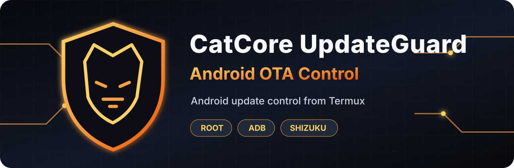

<p align="center">
  
</p>

<p align="center">
  <a href="README.md">English</a> · <a href="README_DE.md">Deutsch</a> · <strong>中文</strong>
</p>

<p align="center">
  
  
  
</p>

<p align="center"><strong>在 Termux 中使用 Root、ADB 或 Shizuku 阻止不需要的 Android 更新组件。</strong></p>

CatCore UpdateGuard 是一个多语言 Termux 工具，用于在软件包/组件层面控制 OTA、Google 和厂商更新组件。它为不同权限提供多种方式：**ADB、Shizuku 或 Root**—可选择设备上可用的方式。

这对现代 **临时 Root（TempRoot）** 尤其重要：意外的 OTA 更新可能移除临时 Root，或引起与更新相关的启动/安全问题。UpdateGuard 可帮助阻止意外更新，让你决定何时以及如何更新设备。

> UpdateGuard 不会修改 `/system`、`/vendor`、boot 或 `vbmeta`。不同设备的 Android 固件存在差异，应用更改前请检查检测到的软件包。阻止更新后，重要的安全更新需要在准备好时手动安装。

## 安装

1. 从[官方项目](https://github.com/termux/termux-app#installation)安装 Termux。不要混用来自不同来源的 Termux 与插件。
2. 将 [`CCUpdateGuard.sh`](CCUpdateGuard.sh) 下载到手机的 **Download** 文件夹。
3. 打开 Termux 并运行：

```bash
pkg update
pkg install bash
termux-setup-storage
cp ~/storage/downloads/CCUpdateGuard.sh ~/
chmod +x ~/CCUpdateGuard.sh
```

## 使用 Root 启动

为你的设备选择合适的 [Android Root 指南](https://github.com/awesome-android-root/awesome-android-root/blob/main/docs%2Frooting-guides%2Findex.md)。在超级用户管理器（例如 Magisk、KernelSU 或 APatch）中授予 **Termux** `su` 权限。

触发权限请求并验证 Root：

```bash
su -c id
```

然后启动 UpdateGuard，并选择 **Root / su**：

```bash
bash ~/CCUpdateGuard.sh
```

## 使用 ADB 启动

按照官方 [Android ADB 无线连接指南](https://developer.android.com/tools/adb#connect-to-a-device-over-wi-fi)启用**开发者选项**和**无线调试**。建议使用分屏，同时保持“无线调试”页面与 Termux 打开。

在 Termux 中安装 ADB，使用 Android 显示的配对地址/端口完成配对，再使用单独的无线调试地址/端口连接：

```bash
pkg install android-tools
adb pair IP地址:配对端口
adb connect IP地址:调试端口
adb devices
bash ~/CCUpdateGuard.sh
```

在 UpdateGuard 中选择 **ADB**。设备必须在 `adb devices` 中显示为 `device`。

## 使用 Shizuku 启动

安装 [Shizuku](https://github.com/RikkaApps/Shizuku)，并按照官方 [Shizuku 设置指南](https://shizuku.rikka.app/guide/setup/)启动。打开 Shizuku 中的 **Use Shizuku in terminal apps**，为 Termux 导出 `rish` 文件，并在 Shizuku 请求授权时允许/激活 Termux。

将 `rish` 和 `rish_shizuku.dex` 放到 Termux 能找到的位置（例如 `$PREFIX/bin`），然后授予 `rish` 执行权限：

```bash
cp /导出文件路径/rish "$PREFIX/bin/rish"
cp /导出文件路径/rish_shizuku.dex "$PREFIX/bin/rish_shizuku.dex"
chmod +x "$PREFIX/bin/rish"
rish -c id
bash ~/CCUpdateGuard.sh
```

在 UpdateGuard 中选择 **Shizuku / rish**。

## 以后再次启动

```bash
bash ~/CCUpdateGuard.sh
```

界面会根据 Android/Termux 的区域设置自动使用**英语、德语或中文**。状态保存在 `~/.catcore-updateguard`；如果已授予存储访问权限，报告和日志将写入 `Download/CatCore-UpdateGuard`。

### 仅限 Root 的用户更新服务移除器

最后一个菜单选项被明确标记为 **[危险]**。它会列出类似更新程序的系统软件包，并可通过 `pm uninstall --user` 仅从**当前 Android 用户配置**中移除你选择的软件包；绝不会删除系统分区中的 APK。执行移除前，UpdateGuard 会依次要求输入 `Y`、本地化确认词，并单独确认红色警告。APK 副本和软件包清单会保存到 `Documents/BackupsOSU/<时间戳>`。**Reverse Select**、**Reverse all** 和 **Reverse + Hard Broken Checker** 会使用 `install-existing` 为原用户重新安装这些软件包。

## 重要 TempRoot 说明

- 软件包禁用状态可能在重启或临时 Root 失效后继续保持。
- 停止的 `update_engine` 进程只在当前启动周期内停止。
- 以后恢复更改时，需要再次拥有可用权限：Root、已连接的 ADB 或正常工作的 Shizuku。
- 保护启用期间不要删除 `~/.catcore-updateguard`；其中保存了恢复所需的状态。

## 免责声明

使用 CatCore UpdateGuard 的风险由用户自行承担。对于更新失败、安全补丁缺失、应用或设备不稳定、访问权限丢失及其他损失，作者不承担任何责任。通过 ADB 阻止更新组件通常是相对安全且可逆的用户级方法，但并非完全没有风险；而且在更新被阻止期间，重要的 Android 安全更新不会自动到达。请检查每个选定的软件包，并在主动更新设备前恢复相关组件。

## Release

下载当前的 [`v1.0.0 Release`](https://github.com/ctrl-mietze/CatCore-UpdateGuard/releases/tag/v1.0.0)，其中包含可直接运行的 `CCUpdateGuard.sh` 资源以及 GitHub 自动生成的源代码归档。最新源代码也仍可直接在 `main` 分支中获取。

---

<p align="center">
  <strong>CatCore UpdateGuard</strong><br>
  选择你的权限方式，掌控你的系统更新。
</p>
